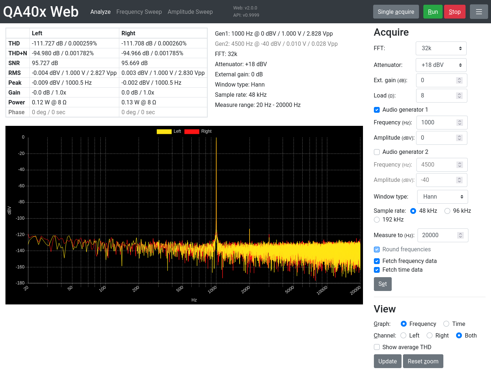
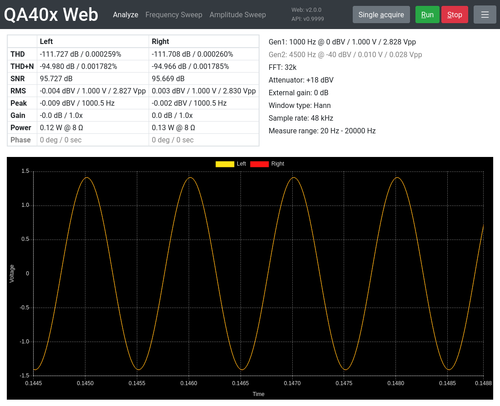
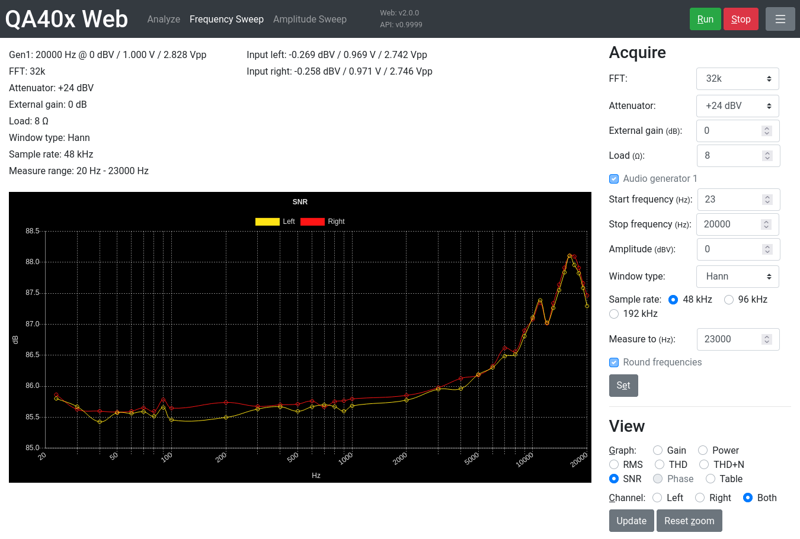
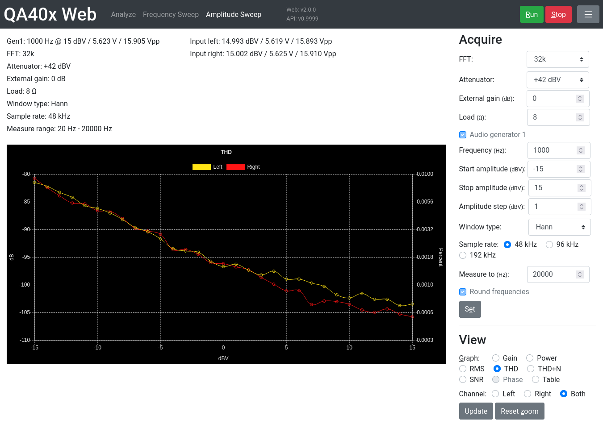

# QA40x Web

Unofficial web interface for the [QA402 Audio Analyzer](https://quantasylum.com/collections/frontpage/products/qa402-audio-analyzer) using the REST API of the [QA40x Analyzer](https://github.com/QuantAsylum/QA402).

See [QA401 Web](https://github.com/blurpy/qa401w) for a version for the QA401. QA40x Analyzer and QA40x Web will eventually include support the QA401.

## Features

Please read the manual for the Analyzer software to understand how to use the QA402. This app offers a lot of the functionality of the Windows software, but is not feature complete.

### Analyze mode

Analyze acquisitions over a frequency range from 20Hz to a specified stop frequency, using static settings.

* Use single or continuous acquisition.
* Choose to see only left channel, right channel, or both channels.
* Hover over a point in the graph for X, Y values.
* Zoom and pan in the graph to see more details.
* Optionally calculate the average THD of the last 100 acquisitions in continuous mode.
* When specifying an external gain, the real input voltage will be shown in addition to the calculated voltage.
* View up to 0.3 seconds of the recorded waveform as a time series graph. Remember to enable fetching of time data.
 

### Frequency sweep mode

Run frequency sweeps and record data at predefined steps along the way.

* Choose one graph to follow in real time while sweep runs.
* Switch between the different graphs after sweep is finished to view recorded results.
* The results can also be viewed in table mode and copied into a spreadsheet for further processing.

### Amplitude sweep mode

Run amplitude sweeps and record data at defined steps along the way.

* Choose one graph to follow in real time while sweep runs.
* Switch between the different graphs after sweep is finished to view recorded results.
* The results can also be viewed in table mode and copied into a spreadsheet for further processing.

### Keyboard shortcuts

* Shift + M - Show/hide the settings menu on the right
* Shift + A - Do a single acquisition (only Analyze page)
* Shift + R - Run continuous acquisition or sweep
* Shift + S - Stop continuous acquisition or sweep
* Shift + E - Set current acquisition settings
* Shift + G - Cycle through the graph choices
* Shift + C - Cycle through the channel choices
* Shift + Z - Reset graph zoom

Tip: hide the menu when taking screenshots and then use the keyboard shortcuts.

## How to use

1. [Download](https://github.com/QuantAsylum/QA402/releases) and start QA40x v0.997 or newer.
2. [Download](https://github.com/blurpy/qa40xw/releases) the code from this repository and open [analyze.html](analyze.html) in the browser.

### Notes

Settings (like buffer size, frequency, ...) are configured on the QA402 device itself. If you use this app in multiple tabs it's recommended to click the "Set" button before starting acquisition to avoid running with the settings from the previous tab instead of the current one.
